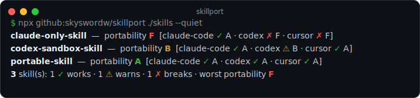

# skillport

[](https://www.npmjs.com/package/@skyswordw/skillport)
[](https://github.com/skyswordw/skillport/actions/workflows/ci.yml)
[](./LICENSE)


**Will your `SKILL.md` work on Claude Code, Codex, *and* Cursor? Catch what breaks before you publish.**



`skillport` is a fast, static, zero-dependency linter for [Agent Skills](https://agentskills.io/specification). Point it at a skill and it tells you, **per agent**, whether the skill will *work*, *degrade*, or *break* — with the exact rule, a fix, and a link to the spec. Run it locally or as a CI gate.

It is **not** another format validator. Plenty of tools check a skill against one agent's schema. `skillport` is about **cross-agent portability**: the things a skill does that silently change behavior — or stop working — when the same `SKILL.md` runs somewhere other than where it was written.

## See it

The same `changelog-bot` skill, before and after making it portable:

```console
$ npx github:skyswordw/skillport examples/before/changelog-bot

changelog-bot  —  portability F  [claude-code ✓ A · codex ✗ F · cursor ✗ F]
  ✗ FORK-001  context: fork is Claude-only  [codex, cursor]
     `context: fork` runs the skill in an isolated Claude subagent; Codex and
     Cursor ignore it and run the skill inline, changing behavior.
     fix: Remove `context: fork` (and `agent:`) for portability.
     https://code.claude.com/docs/en/skills
  ⚠ SUBSTITUTION-001  Argument/variable substitution is Claude-only  [codex, cursor]
  ⚠ MODEL-001  model override is Claude-only  [codex, cursor]
  ... (2 more)

1 skill(s): 0 ✓ works · 0 ⚠ warns · 1 ✗ breaks · worst portability F
```

```console
$ npx github:skyswordw/skillport examples/after/changelog-bot

changelog-bot  —  portability A  [claude-code ✓ A · codex ✓ A · cursor ✓ A]
  ✓ no cross-agent issues

1 skill(s): 1 ✓ works · 0 ⚠ warns · 0 ✗ breaks · worst portability A
```

The behavior the agent performs is identical — the *before* version just encoded it in ways only Claude Code understands. Full walkthrough in [`examples/`](./examples).

## Why

The Agent Skills format is portable in theory, but each agent extends it. A skill authored in Claude Code may quietly rely on `context: fork`, `hooks`, `model:` overrides, `` !`dynamic` `` command injection, or `$ARGUMENTS` substitution — none of which Codex or Cursor honor. The result is a skill advertised as cross-agent that only really works in one. The current "best practice" is to install it in each agent and eyeball the difference. `skillport` makes that a one-second, deterministic check.

## Quick start

No install required (published on npm, or run straight from GitHub):

```bash
# Lint one skill, a skill dir, or a whole repo (recursively finds SKILL.md)
npx @skyswordw/skillport ./skills/my-skill
# or: npx github:skyswordw/skillport ./skills/my-skill

# Only care about a subset of agents
npx github:skyswordw/skillport ./skills --target claude-code,codex

# Compact one-line-per-skill view for big repos
npx github:skyswordw/skillport ./skills --quiet

# Machine-readable output
npx github:skyswordw/skillport ./skills --json
```

### Options

| Flag | Meaning |
|------|---------|
| `-t, --target <list>` | Agents to check: `claude-code,codex,cursor,all` (default `all`) |
| `-q, --quiet` | One line per skill, no finding detail |
| `--json` | Machine-readable JSON |
| `--check` | Exit non-zero if any targeted agent **breaks** |
| `--strict` | With `--check`, also fail on warnings |
| `--no-color` | Disable ANSI color |

## What it checks (v0.1)

| Rule | Severity | Breaks on | What it catches |
|------|----------|-----------|-----------------|
| `NAMING-001` | error | all | Missing/invalid `name` (lowercase kebab-case, ≤64) |
| `NAMING-002` | warning | all | `name` doesn't match its directory |
| `DESCRIPTION-001` | error | all | Missing/empty `description` |
| `DESCRIPTION-002` | warning | all | `description` over the 1024-char portable limit |
| `FORK-001` | error | codex, cursor | `context: fork` (Claude subagent isolation) |
| `FORK-002` | error | codex, cursor | `agent:` subagent selector |
| `HOOKS-001` | error | codex, cursor | `hooks:` field or `hooks/` directory |
| `TOOLS-001` | warning | codex, cursor | `allowed-tools` / `disallowed-tools` |
| `MODEL-001` | warning | codex, cursor | `model:` override |
| `EFFORT-001` | warning | codex, cursor | `effort:` override |
| `INJECTION-001` | warning | codex, cursor | `` !`cmd` `` / ` ```! ` dynamic command injection |
| `SUBSTITUTION-001` | warning | codex, cursor | `$ARGUMENTS`, `$1`, `${CLAUDE_*}` substitution |
| `INVOCATION-001` | warning | codex | `disable-model-invocation` without an `agents/openai.yaml` equivalent |
| `SANDBOX-001` | warning | codex | Scripts using `npm/pip install`, `curl`, `wget`, `git clone` under Codex's network-off sandbox |

Every rule links to the authoritative Claude Code / Codex / Agent Skills documentation it is based on.

## Grading

Each target agent starts at 100; every finding subtracts by severity (error −40, warning −15). The letter grade is `A` (≥90) … `F` (<60). A skill's **overall portability grade is its weakest target** — a skill is only as portable as the agent it breaks on.

- `✓ works` — no findings for that agent
- `⚠ warns` — behavior may differ
- `✗ breaks` — an error-level incompatibility

## CI usage

As a composite action:

```yaml
# .github/workflows/skillport.yml
name: skill-portability
on: [pull_request]
jobs:
  skillport:
    runs-on: ubuntu-latest
    steps:
      - uses: actions/checkout@v4
      - uses: skyswordw/skillport@main
        with:
          path: ./skills
          target: claude-code,codex,cursor
          # strict: "true"   # also fail on warnings
```

Or plain `npx` (see [`examples/skillport.yml`](./examples/skillport.yml)):

```yaml
- uses: actions/setup-node@v4
  with: { node-version: 22 }
- run: npx github:skyswordw/skillport ./skills --check
```

## Seen in the wild

I scanned **200 `SKILL.md` files from 184 public repos** with skillport. **41% aren't valid Agent Skills** at all (missing `name`/`description` — broken on every agent), and of the ones that *are* valid, **~1 in 6 use Claude-only features** (`allowed-tools`, `$ARGUMENTS`, `disable-model-invocation`) that silently break on Codex/Cursor. Full writeup with method and caveats: [docs/portability-in-the-wild.md](./docs/portability-in-the-wild.md).

## Roadmap

`skillport` is the static half of a bigger idea. Next: **behavioral** cross-agent testing — actually running a skill headlessly on `claude -p` and `codex exec` against a fixture repo and asserting the outcomes match. Static portability first, behavior matrix next.

## Development

```bash
npm install      # project-local; no global installs
npm run check    # typecheck
npm test         # build + run the node:test suite
npm run build    # emit dist/
npm run demo     # run skillport on its own fixtures
```

## Contributing

Issues and PRs welcome — new rules especially. See [CONTRIBUTING.md](./CONTRIBUTING.md); changes are tracked in [CHANGELOG.md](./CHANGELOG.md).

## Related

Part of a small set of honest-by-default QA tools for AI-assisted development:

- **skillport** (this repo) — static cross-agent skill linter
- **[skillmatrix](https://github.com/skyswordw/skillmatrix)** — behavioral cross-agent skill testing: run a skill on each agent and assert outcomes
- **[claimcheck](https://github.com/skyswordw/claimcheck)** — a CI receipt for the claims your PR makes

## License

MIT © skyswordw
